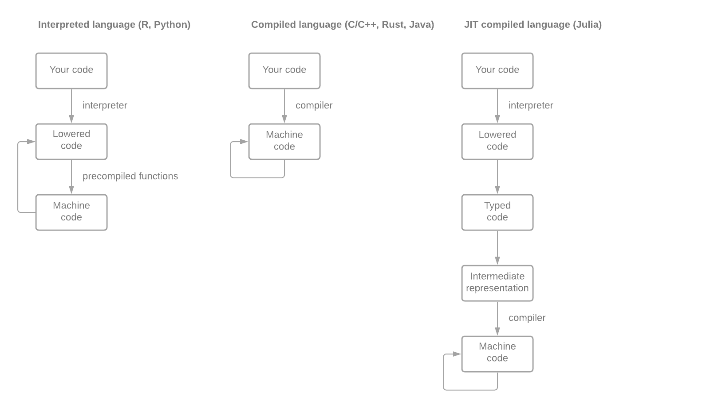

# Interpreted vs. Compiled Languages

R is an *interpreted* language which means that it can be run line-by-line. This is in contrast to a *compiled* language like C or C++, where code is translated directly to machine code that is native to the PC it is compiled on.

```{r 102-Brutal-Olive-Cosmic, echo=FALSE}

```

## A really dumb example

*Multiplying two integers by repeated addition*

**R**

```{r 102-Morbid-Parachute}
my_mul <- function(a, b) {
  stopifnot(is.integer(a), is.integer(b), a >= 0, b > 0)
  m <- 0L
  for (i in 1:b) {
    m <- m + a
  }
  return(m)
}
```

Very slow (by computer standards).

```{r 102-Global-Peasant}
system.time(my_mul(123L, 16777216L))
system.time(123L * 16777216L)
```


**C++ (via Rcpp)**

```{Rcpp 102-Supersonic-Haystack}
#include <Rcpp.h>

//[[Rcpp::export]]
int my_mul_cpp(int a, int b) {
  int m = 0;
  for(int i = 0; i < b; i++) {
    m += a;
  }
  return m;
}
```

Very fast (with just a little bit of overhead for R to call the C code), but why is it so much faster?

```{r 102-Needless-Dog}
system.time(my_mul_cpp(123, 16777216))
system.time(my_mul_cpp(123, 16777216))
```

**Julia**

```{julia 102-Permanent-Breeze}
function my_mul(a::Int, b::Int)
    m = 0
    for _ in 1:b
        m += a
    end
    return m
end; # semicolon hides output from the repl
```

Julia is just as fast as the C++ code. Again, why?

```{julia 102-Dusty-Comic}
@time my_mul(123, 16777216)
@time my_mul(123, 16777216)
```

Since Julia is a JIT compiled langauge, we can actually look at what the intermediate representation of the code is. In this case, the compiler is smart enough to realize that we are multiplying two integers (`%2 = mul i64 %0, %1`), and optimizes the code as such.

```{julia 102-Wild-Wooden-Sound}
using InteractiveUtils
@code_llvm my_mul(123, 4567890)
```
